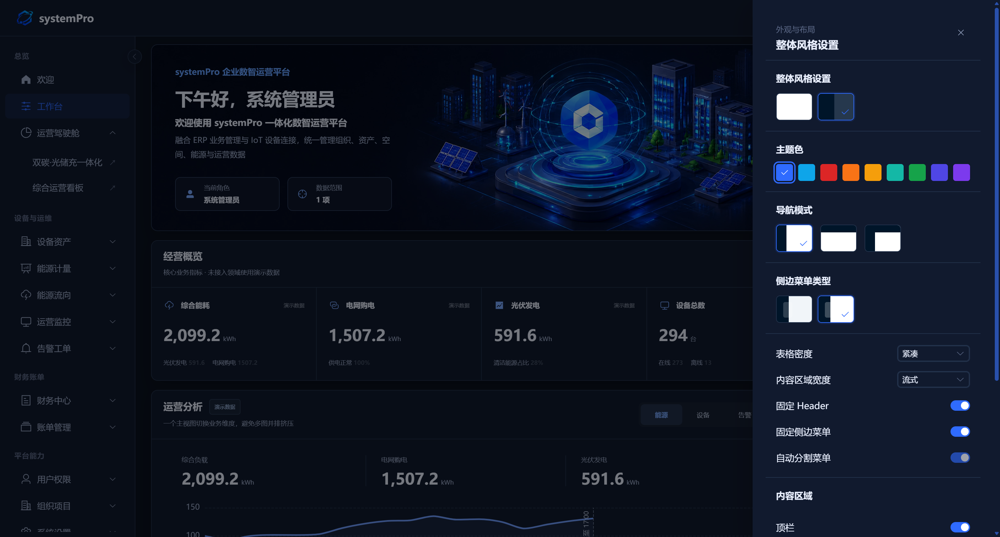
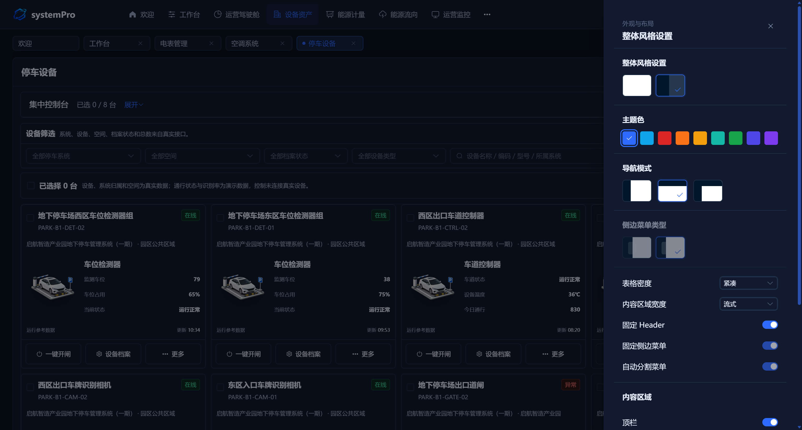

<p align="center">
  
</p>

<h1 align="center">systemPro</h1>

<p align="center">
  <b>企业级能源物联网运营平台</b><br />
  <sub>设备物联 · 能源计量 · 暖通集中控制 · 财务结算 · 权限治理</sub>
</p>

<p align="center">
  
  
  
  
  
</p>

<p align="center">
  <a href="http://console.systempro.site"><b>在线体验</b></a>
  &nbsp;·&nbsp;
  <a href="http://systempro.site"><b>官网</b></a>
  &nbsp;·&nbsp;
  <a href="https://gitee.com/sitepulse/system-pro"><b>源码仓库</b></a>
</p>

---

systemPro 面向园区、楼宇、工厂与能源项目，提供面向园区能源运营的**软件平台方案**，覆盖设备接入、分项计量、暖通集中控制、财务结算与权限治理，把设备、能源、财务与组织权限收敛到同一套工程分层，帮助运营方从「设备分散、账目不清」走向「集中可控、账实一致」。

## 核心能力

| 能力域 | 说明 |
| --- | --- |
| 一体化能源驾驶舱 | 双碳指标与光储充一体化看板，管理层一屏掌握经营与能源全貌 |
| 八类设备统一建档 | 电表、水表、空调、照明、停车、充电、光伏、储能资产档案统一纳管 |
| 空调集中控制 | 中央空调、多联机与新风系统统一纳管，分区控制与场景联动 |
| 分项计量与损耗分析 | 真实供电拓扑与分项计量口径，用能账目追溯至空间与租户 |
| 告警转工单闭环 | 规则配置、转工单与历史统计，形成完整处理闭环 |
| 财务全流程 | 银企直连、收款核销、调账退款与开票管理，业务财务数据打通 |
| 多租户与权限体系 | 组织架构、空间层级、RBAC 权限与 SSO 绑定 |
| 部署无需重新打包 | 接口地址运行时配置，切换环境无需重新构建前端 |

---

## 平台架构

平台采用四层架构：设备层接入现场资产，数据接入层统一设备数据，业务能力层沉淀能源、设备、财务与权限能力，应用层面向不同角色提供工作入口。

```text
设备层        电表 / 水表 / 空调 / 照明 / 停车 / 充电 / 光伏 / 储能
      ↓
数据接入层    MQTT / Modbus / REST API
      ↓
业务能力层    能源 / 设备 / 财务 / 权限
      ↓
应用层        驾驶舱 / 运营后台 / 移动端
```

---

## 功能导览

**平台首页**

欢迎与模块索引是平台的统一入口，聚合设备、能源、财务与平台能力各业务模块的概览与导航。

<p align="center">
  
</p>

**能源驾驶舱**

双碳·光储充一体化驾驶舱与综合运营看板，融合经营、能源与 IoT 指标，管理层一屏掌握全貌。

<p align="center">
  
</p>

<p align="center">
  
</p>

**空调设备 · 集中控制**

> 面向空调系统的统一纳管与集中控制：覆盖中央空调、分体空调、多联机与新风系统，单台设备的接入档案、运行状态与所属系统一目了然；整栋楼宇的分区策略与场景联动集中配置，将「单机分散管理」升级为「集中可控、场景联动」。

<p align="center">
  
</p>

<p align="center">
  
  
</p>

**设备资产**

电表、水表、空调、照明、停车、充电、光伏、储能八类设备资产统一建档，维护总表分表关系、倍率与采集状态，覆盖电表预付费等常见场景。

<p align="center">
  
</p>

**能源流向**

能源拓扑图与光储充能源概览，实时呈现光伏、储能、负载与公共电网的能量平衡。

<p align="center">
  
</p>

<p align="center">
  
</p>

**能源计量**

计费方案与计费开通让用能账目可追溯到每一个空间和租户。

<p align="center">
  
</p>

<p align="center">
  
  
</p>

**运营监控与告警**

设备实时监控、网关/链路状态、并离网切换与视频监控接入；告警从规则配置、转工单到历史统计形成闭环。

<p align="center">
  
</p>

<p align="center">
  
  
</p>

**财务账单**

银企直连、收款核销、调账退款与开票管理；依据冻结用量和生效费率生成可追溯账单，跟踪支付、开票、逾期和关闭状态。

<p align="center">
  
</p>

<p align="center">
  
</p>

**平台能力**

账号、角色、菜单、操作与数据权限构成企业级 RBAC 体系；组织架构、空间层级与租户档案解耦管理。

<p align="center">
  
  
</p>

<p align="center">
  
  
</p>

<p align="center">
  
  
</p>

<details>
<summary>查看更多截图</summary>

<p align="center">
  
  
</p>

<p align="center">
  
  
</p>

<p align="center">
  
</p>

</details>

---

## 工程架构

工程按职责分层：`core` 提供平台基础能力，`design-system` 沉淀统一设计体系，`domain` 承载业务领域模块，`pages` 只做页面入口。完整目录与分层说明见 [docs/architecture.md](./docs/architecture.md)。

```text
systemPro
│
├── core            平台基础能力
│
├── design-system   统一设计体系
│
├── domain          业务领域模块
│
├── pages           页面入口
│
└── router / store  应用基础设施
```

---

## 快速开始

| 项 | 值 |
| --- | --- |
| Node.js | ≥ 18（建议 LTS） |
| 体验地址 | [console.systempro.site](http://console.systempro.site) |
| 体验账号 | `system` / `12345678`（公开只读） |

```bash
npm install
npm run dev
```

启动后默认访问 `http://127.0.0.1:5173`；端口被占用时 Vite 自动切换，以终端输出为准。

```bash
npm run build
npm run preview
```

构建产物输出至 `dist/`，可直接部署至 Nginx 或任意静态资源服务器。

接口地址通过 `public/app-config.js` 运行时配置管理，构建时原样复制到 `dist/app-config.js`，切换部署环境的接口地址无需重新打包前端。

```js
window.__SYSTEMPRO_PUBLIC_CONFIG__ = {
  apiBaseUrl: 'https://your-backend-domain.com',
}
```

本地开发可将 `apiBaseUrl` 指向自有后端，或使用官方演示后端 `http://console.systempro.site` 体验只读数据。

---

## 技术栈

<p align="left">
  
  
  
  
  
  
  
  
  
</p>

| 层 | 技术 |
| --- | --- |
| 前端 | Vue 3 · TypeScript · Vite · Pinia · Element Plus · ECharts · vue-i18n |
| 后端 | Java 17 · Spring Boot 3 · MyBatis-Plus |
| 数据 | MySQL 8 · Liquibase（版本化迁移） |
| 缓存 | Redis |
| IoT | MQTT · Modbus · REST API |
| 安全 | Spring Security · OAuth2 / JWT |

---

## License

本项目基于 [MIT](https://opensource.org/licenses/MIT) 许可证开源。

---

<p align="center"><sub>systemPro —— 面向企业能源运营场景构建的数字化平台基础。</sub></p>
