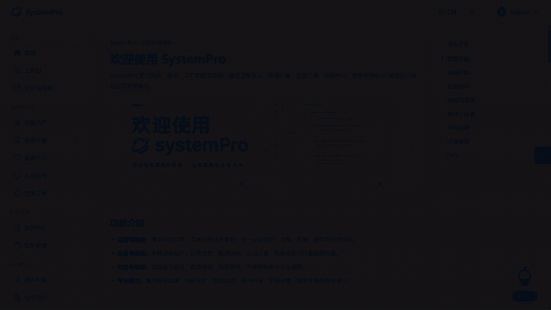
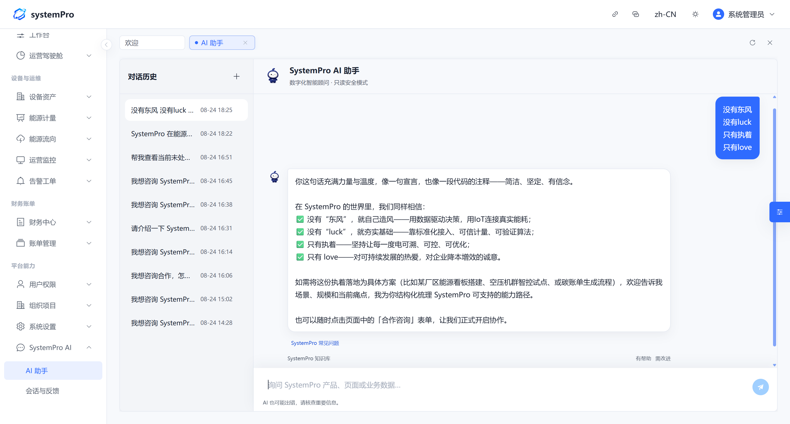
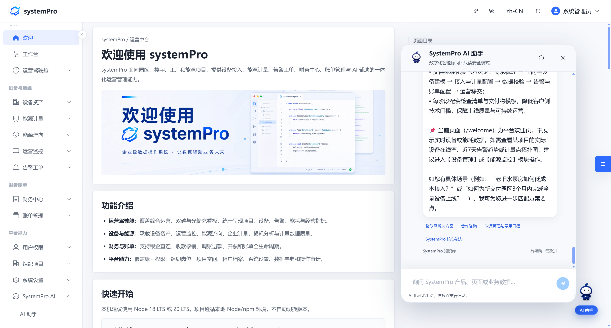

<p align="center">
  
</p>

<h1 align="center">systemPro</h1>

<p align="center">
  <strong>企业级开源物联网与能源管理平台</strong>
</p>

<p align="center">
  支持设备接入、能源计量、告警工单、账单管理与二次开发
</p>

<p align="center">
  <a href="./README.md">English</a> · 简体中文
</p>

<p align="center">
  
  
  
  
  
</p>

<p align="center">
  <a href="https://console.systempro.site"><strong>在线演示</strong></a>
  ·
  <a href="#快速开始"><strong>快速开始</strong></a>
  ·
  <a href="#产品能力"><strong>产品能力</strong></a>
  ·
  <a href="./docs/architecture.md"><strong>架构说明</strong></a>
  ·
  <a href="./docs/CONFIGURATION.md"><strong>配置文档</strong></a>
</p>

<p align="center">
  演示账号：<code>system</code>&nbsp;&nbsp;&nbsp;密码：<code>12345678</code>
</p>

<p align="center"><sub>演示账号是与企业数据隔离的公开只读账号，请勿在体验环境录入真实敏感信息。</sub></p>

<p align="center">
  
</p>

## systemPro 是什么

systemPro 是一套面向园区、楼宇、工厂和光储充场景的企业级物联网与能源管理平台。平台将组织权限、设备资产、运行监控、能源计量、告警工单和财务账单放在同一套业务架构中，帮助项目统一管理电表、水表、空调、照明、停车、充电桩、光伏和储能等设备。

它既可以用于了解一套完整的 IoT 能源管理系统如何组织业务，也可以作为 Vue 3 企业管理端、设备管理平台或能源管理项目的二次开发基础。

> 当前仓库提供 systemPro 公开版管理端源码。部分需要完整后端、真实设备或商业业务流程支持的能力，在公开版中保留稳定菜单、路由和产品说明，但不包含正式版实现。详见[公开源码版能力边界](./docs/public-edition-boundary.md)。

## 产品演示

<p align="center">
  <a href="https://console.systempro.site">
    
  </a>
</p>

<p align="center">
  <sub>25 秒了解综合运营、双碳光储充、能源拓扑、能源计量、空调集控与 AI 助手。<a href="./assets/demo/systempro-demo.mp4">查看 MP4 版本</a>。</sub>
</p>

## 为什么选择 systemPro

| 统一设备资产 | 能源业务闭环 | 企业权限底座 | 工程化交付 |
| --- | --- | --- | --- |
| 电表、水表、空调、照明、停车、充电、光伏、储能统一建档 | 从能源拓扑、分项计量、费率到告警、工单和账单 | 组织、项目、空间、角色、菜单、操作与数据权限 | Vue 3 + TypeScript，模块化分层，运行时切换接口地址 |

## 产品能力

| 能力域 | 主要能力 | 公开版说明 |
| --- | --- | --- |
| 运营驾驶舱 | 项目、设备、能源、告警和运营指标统一呈现 | 已提供 |
| 设备资产 | 电表、水表、空调、照明、停车、充电桩、光伏、储能 | 已提供 |
| 能源管理 | 能源流向、物理拓扑、总分表关系、分项计量、损耗分析 | 已提供 |
| 运行监控 | 设备状态、网关链路、并离网状态、停车与视频接入页面 | 已提供 |
| 告警工单 | 历史告警；正式版扩展规则、转工单和处理闭环 | 部分提供 |
| 财务账单 | 计费方案、用量冻结、账单、核销、退款和开票业务 | 正式版场景 |
| 用户权限 | RBAC、菜单权限、操作权限、数据权限和第三方登录绑定 | 已提供 |
| 组织项目 | 组织架构、部门岗位、空间层级、租户与项目边界 | 部分提供 |
| AI 助手 | 统一对话页面、可拖拽悬浮入口和服务端对接思路 | 前端入口已提供 |

### 设备管理与能源计量

围绕企业设备资产和能源数据建立统一模型，覆盖设备档案、设备接入信息、实时状态、总分表关系、能源拓扑、分项计量、费率和损耗分析等常见业务。

<table>
  <tr>
    <td width="50%" align="center">
      
      <br/><sub>设备资产与计量档案</sub>
    </td>
    <td width="50%" align="center">
      
      <br/><sub>能源拓扑与能量流向</sub>
    </td>
  </tr>
</table>

### 空调系统与集中控制

将“系统”和“设备”分层管理：系统负责分区、策略和业务归属，设备负责接入参数、运行状态和执行对象，适用于中央空调、多联机、新风和分体空调等场景。

<table>
  <tr>
    <td width="50%" align="center">
      
      <br/><sub>空调设备集中控制</sub>
    </td>
    <td width="50%" align="center">
      
      <br/><sub>空调系统与分区策略</sub>
    </td>
  </tr>
</table>

### 告警、工单与运营监控

统一呈现设备告警、链路状态和运行状态；正式版可进一步连接告警规则、工单流转和处理审计，形成从发现异常到跟踪处置的闭环。

<table>
  <tr>
    <td width="50%" align="center">
      
      <br/><sub>告警统计</sub>
    </td>
    <td width="50%" align="center">
      
      <br/><sub>并离网运行监控</sub>
    </td>
  </tr>
</table>

### 财务账单与计费场景

产品能力覆盖计费方案、计费开通、用量冻结、账单生成、收款核销、调账退款和开票管理，使能源用量、费率口径和应收账单能够相互追溯。公开仓库展示相关产品场景，完整交易流程属于正式版能力。

<table>
  <tr>
    <td width="50%" align="center">
      
      <br/><sub>能源计费开通</sub>
    </td>
    <td width="50%" align="center">
      
      <br/><sub>账单管理</sub>
    </td>
  </tr>
</table>

### 组织、项目与权限

组织架构、项目空间与账号权限相互解耦，通过角色、菜单、操作和数据权限控制用户能够进入哪些页面、执行哪些操作以及查看哪些数据。

<table>
  <tr>
    <td width="50%" align="center">
      
      <br/><sub>组织、项目与空间层级</sub>
    </td>
    <td width="50%" align="center">
      
      <br/><sub>角色与权限治理</sub>
    </td>
  </tr>
</table>

### SystemPro AI 助手

公开版提供统一的 AI 助手页面、历史对话入口和可拖拽悬浮窗口，并给出服务端对接思路。社区版默认不连接任何模型服务，也不会内置模型密钥；部署者可在自己的服务端配置模型凭据并实现兼容接口。

<table>
  <tr>
    <td width="50%" align="center">
      
      <br/><sub>AI 助手页面</sub>
    </td>
    <td width="50%" align="center">
      
      <br/><sub>可拖拽悬浮入口</sub>
    </td>
  </tr>
</table>

<details>
  <summary><strong>查看更多产品界面</strong></summary>
  <br/>
  <table>
    <tr>
      <td width="33%" align="center"><br/><sub>光储充能源概览</sub></td>
      <td width="33%" align="center"><br/><sub>停车场监控</sub></td>
      <td width="33%" align="center"><br/><sub>照明设备</sub></td>
    </tr>
    <tr>
      <td width="33%" align="center"><br/><sub>菜单权限</sub></td>
      <td width="33%" align="center"><br/><sub>操作权限</sub></td>
      <td width="33%" align="center"><br/><sub>数据权限</sub></td>
    </tr>
    <tr>
      <td width="33%" align="center"><br/><sub>空间层级</sub></td>
      <td width="33%" align="center"><br/><sub>多语言管理</sub></td>
      <td width="33%" align="center"><br/><sub>能源驾驶舱</sub></td>
    </tr>
  </table>
</details>

## 适用场景

- **园区能源管理**：统一管理园区项目、建筑空间、设备资产、能源计量和费用账单。
- **楼宇设备运维**：集中查看空调、照明、水电表、网关和视频监控等运行状态。
- **工厂能耗管理**：建立能源拓扑、分项计量和损耗分析口径，辅助识别异常用能。
- **光储充一体化**：呈现光伏、储能、充电负荷、公共电网和其他负载之间的能量关系。
- **企业 IoT 项目二次开发**：复用管理端布局、权限入口、领域分层、设计系统和运行时配置能力。

## 技术架构

```text
现场设备层     电表 / 水表 / 空调 / 照明 / 停车 / 充电桩 / 光伏 / 储能
      ↓
设备接入层     MQTT / Modbus / REST API / 第三方平台
      ↓
业务服务层     设备资产 / 能源计量 / 告警工单 / 财务账单 / 权限治理
      ↓
应用交互层     运营驾驶舱 / 管理后台 / SystemPro AI 助手
```

当前公开仓库的工程重点是 Vue 3 管理端：

| 类型 | 技术 |
| --- | --- |
| 前端框架 | Vue 3 · TypeScript · Vite · Pinia · Vue Router |
| UI 与可视化 | Element Plus · ECharts · CSS Design Tokens |
| 国际化 | vue-i18n |
| 工程质量 | vue-tsc · 公开仓库检查 · 主题契约 · 性能预算 |
| 接口适配 | REST API · 运行时 API 地址配置 |

正式版业务服务采用 Java 17、Spring Boot 3、MyBatis-Plus、MySQL、Liquibase、Redis 等技术；后端、数据库和生产密钥不包含在当前公开前端仓库中。完整分层与目录职责见[架构说明](./docs/architecture.md)。

## 快速开始

### 环境要求

- Node.js `>= 14.21.0`，建议使用仍在维护的 LTS 版本。
- npm `>= 6.14.0`。
- 不需要为了运行本项目切换或升级已有的全局 Node/npm 环境；请根据自己的开发环境选择合适方式。

### 安装并启动

```bash
git clone https://gitee.com/sitepulse/system-pro.git
cd system-pro
npm install
npm run dev
```

默认访问地址为 `http://127.0.0.1:5173`。如果端口已被占用，Vite 会选择其他端口，请以终端输出为准。

### 构建生产资源

```bash
npm run build
npm run preview
```

构建产物输出至 `dist/`，可以部署到 Nginx 或其他静态资源服务器。仓库包含一份可参考的 [Nginx 静态缓存配置](./deploy/nginx-static-cache.conf.example)。

## 接入自己的后端

接口地址通过 [`public/app-config.js`](./public/app-config.js) 进行运行时配置。该文件会原样复制到 `dist/app-config.js`，部署后可以修改 API 地址，无需重新构建前端。

```js
window.__SYSTEMPRO_PUBLIC_CONFIG__ = {
  appMode: 'api',
  apiBaseUrl: 'https://your-backend-domain.com',
}
```

- `apiBaseUrl` 只填写服务端 Origin，页面会自动拼接 `/api/...` 路径。
- 设置为自己的兼容后端，即可接入真实登录、权限和业务数据。
- 设置 `appMode: 'demo'` 可以在没有后端时进入有限的本地只读演示。
- 浏览器可读取 `app-config.js`，因此禁止在其中配置数据库密码、模型 Key 或其他密钥。

详细说明见[运行时配置](./docs/CONFIGURATION.md)和[数据边界](./docs/DATA_BOUNDARIES.md)。

## 文档导航

| 文档 | 内容 |
| --- | --- |
| [公开源码版能力边界](./docs/public-edition-boundary.md) | 已公开实现、正式版占位与维护约束 |
| [架构说明](./docs/architecture.md) | 前端分层、目录职责与平台架构 |
| [运行时配置](./docs/CONFIGURATION.md) | API 地址、公开演示账号和离线模式 |
| [数据边界](./docs/DATA_BOUNDARIES.md) | 演示数据、浏览器数据与生产数据边界 |
| [安全审查](./docs/SECURITY_REVIEW.md) | 公开仓库安全检查与注意事项 |
| [仓库内容](./docs/REPOSITORY_CONTENTS.md) | 应提交内容、生成目录和维护文件 |
| [第三方说明](./THIRD_PARTY_NOTICES.md) | 依赖与素材来源 |

## 开源范围与安全说明

- 公开演示账号只能访问隔离的只读体验数据，不能作为生产账号使用。
- 前端按钮禁用不是权限边界，真实权限必须由后端根据会话、角色、租户和项目范围校验。
- `public/app-config.js`、前端环境变量和浏览器存储都不能保存密钥。
- 社区版 AI 助手默认不连接任何模型；模型凭据必须保存在部署者自己的服务端。
- 正式版专属页面、写接口、数据库结构和商业业务模型不属于当前公开仓库。

## 参与项目

欢迎通过 [Gitee Issues](https://gitee.com/sitepulse/system-pro/issues) 提交：

- 实际物联网、园区、楼宇或能源管理场景建议；
- 可以稳定复现的问题和修复方案；
- 文档、交互、可访问性与二次开发体验改进；
- 新设备类型、能源计量口径和业务模块的设计建议。

提交安全问题前，请先阅读[安全审查说明](./docs/SECURITY_REVIEW.md)，不要在公开 Issue 中粘贴密码、Token、客户数据或其他敏感信息。

## License

本项目基于 [Apache License 2.0](./LICENSE) 许可证开源。第三方依赖与素材授权见 [THIRD_PARTY_NOTICES.md](./THIRD_PARTY_NOTICES.md)。

---

<p align="center">
  <strong>物联网 · IoT · 能源管理 · 能耗管理 · 设备管理 · 能源计量 · 告警工单 · 账单管理 · 二次开发</strong>
</p>

<p align="center"><sub>systemPro —— 让复杂业务，变得清晰可控。</sub></p>
